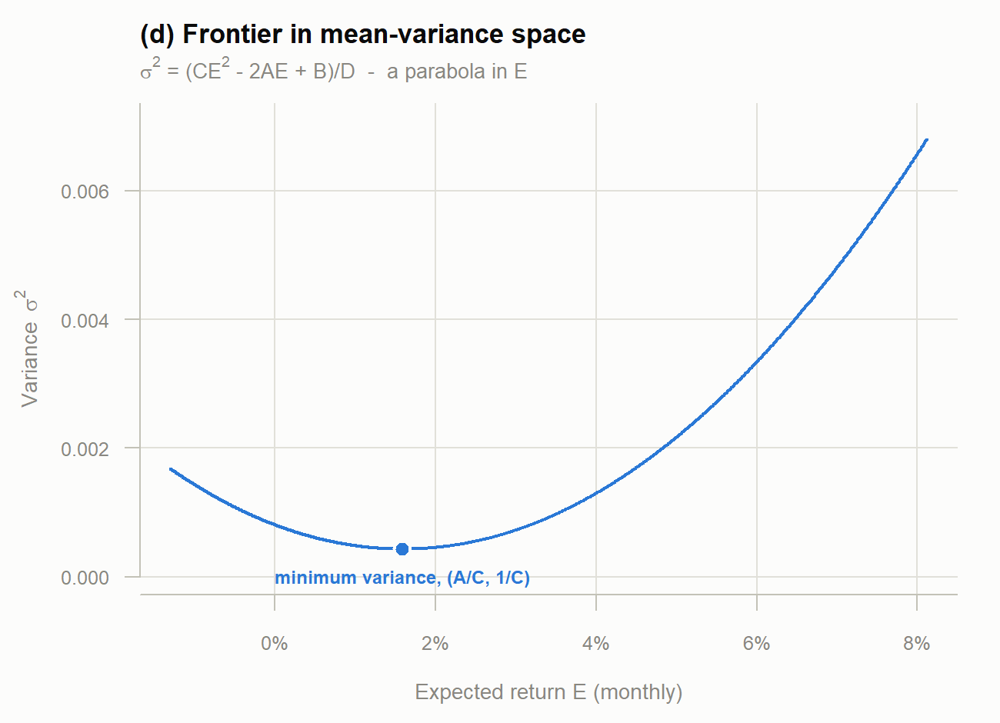
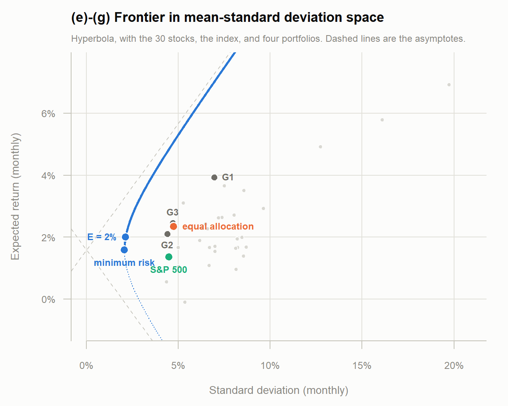
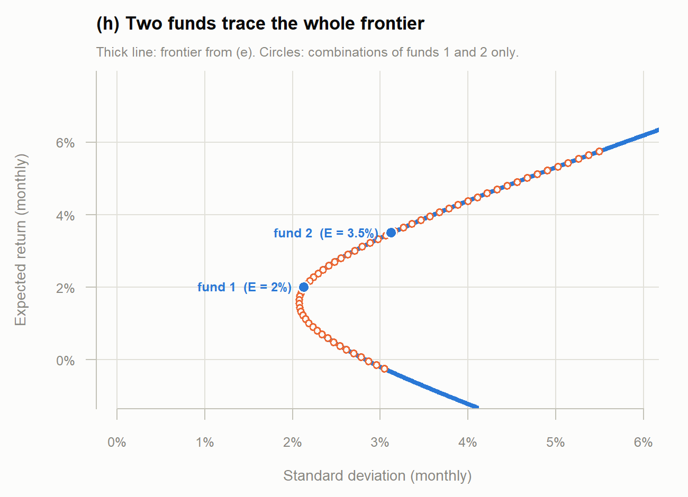

```{r setup, include=FALSE}
knitr::opts_chunk$set(echo = FALSE, comment = "#>", warning = FALSE,
                      message = FALSE)

# The analysis lives in frontier.R; this report reads its results rather than
# re-implementing them, so the document cannot drift from the script.
invisible(capture.output(source("frontier.R")))

pct <- function(x, d = 2) sprintf(paste0("%.", d, "f%%"), x * 100)
```

Same data as Project 1: monthly adjusted close prices for 30 stocks plus the
S&P 500, downloaded from Yahoo Finance through the Shiny app, first five years
only (January 2017 – December 2021). Short sales are allowed throughout, so the
only constraint on the weights is $\mathbf{1}'x = 1$.

Following Merton (1972), $\Sigma$ is the 30 × 30 variance-covariance matrix of
the stock returns and $\bar{R}$ the 30 × 1 vector of mean returns.

## (a)

$$A = \mathbf{1}'\Sigma^{-1}\bar{R}, \qquad
  B = \bar{R}'\Sigma^{-1}\bar{R}, \qquad
  C = \mathbf{1}'\Sigma^{-1}\mathbf{1}, \qquad
  D = BC - A^2$$

```{r abcd}
knitr::kable(data.frame(
  Quantity = c("A", "B", "C", "D"),
  Value    = c(A, B, C, D),
  row.names = NULL), digits = 4)
```

$B > 0$ and $C > 0$ because they are quadratic forms of the positive definite
$\Sigma^{-1}$, and $D > 0$ follows (Merton, footnotes 4 and 5). All three hold
here, so the frontier is well defined.

These constants already pin down the global minimum variance portfolio, which
sits at $\bar{R}_{pmin} = A/C$ with variance $\sigma^2_{pmin} = 1/C$:

```{r gmv}
cat(sprintf("A/C       = %.6f  (%s per month)\n", E_gmv, pct(E_gmv)))
cat(sprintf("sqrt(1/C) = %.6f  (%s per month)\n", sd_gmv, pct(sd_gmv)))
```

This matches the minimum risk portfolio computed directly in Project 1 part (f),
which is a useful check: the same portfolio arrives by two different routes.

## (b)

The Lagrange multipliers come from Merton equation (8):

$$\lambda_1 = \frac{CE - A}{D}, \qquad \lambda_2 = \frac{B - AE}{D}$$

Taking $E = `r pct(E0, 0)`$ per month, which is above $A/C$ and therefore on the
efficient half of the frontier:

```{r lambdas}
cat(sprintf("lambda1 = (CE - A)/D = %.6f\n", lam1))
cat(sprintf("lambda2 = (B - AE)/D = %.6f\n", lam2))
```

## (c)

The weights of the frontier portfolio with prescribed return $E$ are

$$x = \Sigma^{-1}\left[\lambda_1 \bar{R} + \lambda_2 \mathbf{1}\right]$$

```{r cprops}
cat(sprintf("E    = %.4f  (%s per month)\n", E0, pct(E0)))
cat(sprintf("sd   = %.4f  (%s)\n", sd_E, pct(sd_E)))
cat(sprintf("sum of weights = %.6f, %d short positions\n",
            sum(x_E), sum(x_E < 0)))
```

```{r cweights}
w <- sort(setNames(as.numeric(x_E), stk), decreasing = TRUE)
knitr::kable(data.frame(
  Stock  = names(w)[c(1:5, 26:30)],
  Weight = round(unname(w)[c(1:5, 26:30)], 4),
  row.names = NULL), caption = "Five largest and five smallest weights")
```

The same vector can be written $x = g + hE$ with

$$g = \tfrac{1}{D}\left[B\Sigma^{-1}\mathbf{1} - A\Sigma^{-1}\bar{R}\right],
  \qquad
  h = \tfrac{1}{D}\left[C\Sigma^{-1}\bar{R} - A\Sigma^{-1}\mathbf{1}\right]$$

```{r ghcheck}
cat(sprintf("max |x - (g + hE)| = %.2e\n", max(abs(as.numeric(x_E) - x_gh))))
cat(sprintf("sum(g) = %.6f   (equals (BC - A^2)/D = 1)\n", sum(g)))
cat(sprintf("sum(h) = %.2e   (equals (CA - AC)/D = 0)\n", sum(h)))
```

Because $\sum g_i = 1$ and $\sum h_i = 0$, every $x = g + hE$ is automatically
fully invested whatever $E$ is chosen. This is what makes part (h) work.

## (d)

Substituting the multipliers back gives the variance of a frontier portfolio as
a function of its expected return,

$$\sigma^2 = \frac{CE^2 - 2AE + B}{D}$$

a parabola in $E$, with its minimum at $E = A/C$.

```{r parabola, out.width="100%"}

```

## (e)

Completing the square moves the same relation into mean-standard deviation
space:

$$\sigma^2 = \frac{1}{C} + \frac{C}{D}\left(E - \frac{A}{C}\right)^2
  \qquad\Longleftrightarrow\qquad
  \frac{\sigma^2}{1/C} - \frac{\left(E - A/C\right)^2}{D/C^2} = 1$$

which is a hyperbola with centre $(0,\, A/C)$, vertex at
$(\sqrt{1/C},\, A/C)$, and asymptotes $E = A/C \pm \sqrt{D/C}\,\sigma$.

```{r hypcheck}
cat(sprintf("max |hyperbola - sqrt(parabola)| over %d values of E: %.2e\n",
            length(Egrid), max(abs(sd_hyp - sqrt(var_par)))))
```

## (f) and (g)

The plot below is the hyperbola from (e) with everything added: the 30 stocks
and the S&P 500 in grey and green, the equal allocation and minimum risk
portfolios from Project 1, the portfolio from part (c), and three arbitrary
portfolios G1–G3 whose weights sum to one (G1 is equal weight on the six
technology stocks, G2 random and all long, G3 random with short positions).

```{r frontier, out.width="100%"}

```

```{r arbtable}
knitr::kable(data.frame(
  Portfolio     = names(arb),
  `Mean (%)`    = round(arb_mu * 100, 3),
  `Std. dev. (%)` = round(arb_sd * 100, 3),
  check.names = FALSE, row.names = NULL))
```

Every individual stock and every arbitrary portfolio lies to the right of the
curve, as it must: the frontier is by construction the smallest standard
deviation attainable at each level of expected return. The dotted lower arm is
the inefficient half — for each of those portfolios there is one directly above
it with the same risk and a higher return.

## (h)

By the mutual fund theorem the entire frontier is spanned by any two frontier
portfolios. Taking fund 1 to be the portfolio from part (c) and fund 2 a second
efficient portfolio with $E = `r pct(E2, 1)`$, and combining them as in handout
#4 page 5,

$$\bar{R}_p = a\bar{R}_1 + (1-a)\bar{R}_2, \qquad
  \sigma_p^2 = a^2\sigma_1^2 + (1-a)^2\sigma_2^2 + 2a(1-a)\sigma_{12}$$

```{r mfstats}
cat(sprintf("fund 1: E = %.4f, sd = %.4f\n", E1, s1))
cat(sprintf("fund 2: E = %.4f, sd = %.4f\n", E2, s2))
cat(sprintf("\ncov(1,2) from x1' Sigma x2                    = %.8f\n", s12))
cat(sprintf("cov(1,2) from (C/D)(E1-A/C)(E2-A/C) + 1/C    = %.8f\n", s12_closed))
```

The second expression is the closed form for the covariance of two frontier
portfolios from handout #11 part (c); the two agree exactly, which confirms both
funds really are on the frontier.

Letting $a$ range over `r sprintf("%.1f", min(agrid))` to
`r sprintf("%.1f", max(agrid))` (values outside $[0,1]$ mean shorting one fund
to lever the other) traces the curve below. The circles are combinations of the
two funds only — no individual stock is used — and they fall on the frontier
from part (e):

```{r mutualfund, out.width="100%"}

```

```{r mfcheck}
cat(sprintf("max |two-fund combination - frontier| over %d mixes: %.2e\n",
            length(agrid),
            max(abs(mf_sd - sqrt((C * mf_E^2 - 2 * A * mf_E + B) / D)))))
```

Agreement to machine precision, so the result is the same as part (e) as
expected. The practical reading is that an investor needs only these two funds:
any point on the frontier, including the minimum risk portfolio, is some mix of
them.

## Appendix: full code

```{r code, echo=TRUE, eval=FALSE, code=readLines("frontier.R")}
```
