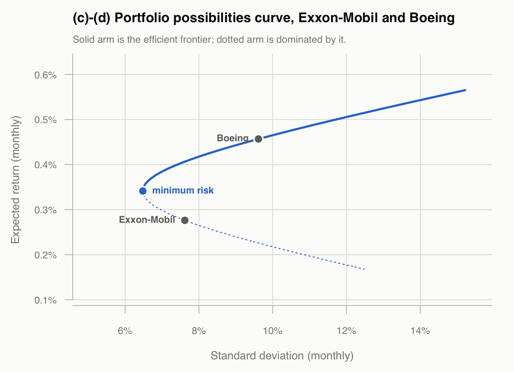
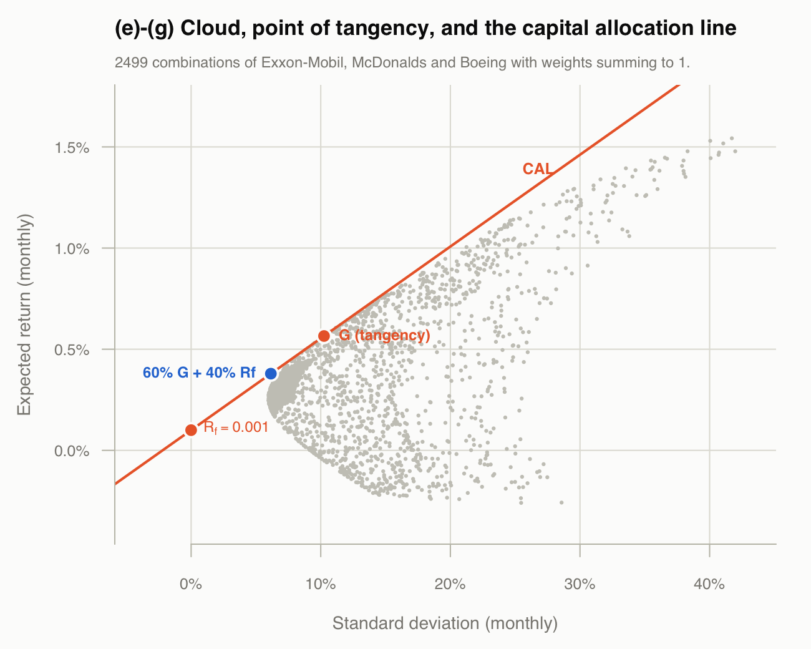
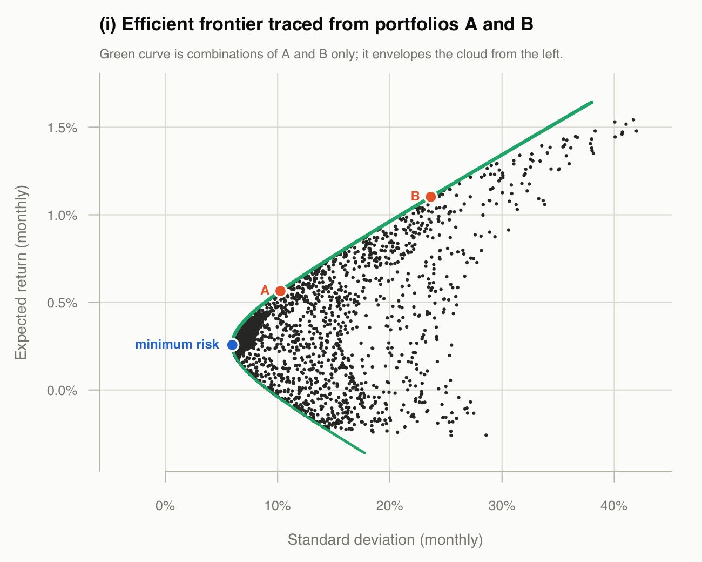

```{r setup, include=FALSE}
knitr::opts_chunk$set(echo = FALSE, comment = "#>", warning = FALSE,
                      message = FALSE, fig.pos = "H", out.extra = "")

# The analysis lives in tangency.R; this report reads its results rather than
# re-implementing them, so the document cannot drift from the script.
invisible(capture.output(source("tangency.R")))

pct <- function(x, d = 2) sprintf(paste0("%.", d, "f%%"), x * 100)
```

## (a)

Prices become simple monthly returns, $R_t = P_t/P_{t-1} - 1$. 216 prices give 215 returns for each of the 5 stocks.

```{r retdim}
cat(sprintf("first month: %s    last month: %s\n",
            format(dates[1], "%Y-%m"), format(dates[length(dates)], "%Y-%m")))
cat(sprintf("returns: %d months x %d stocks\n", nrow(ret), ncol(ret)))
```

## (b)

```{r means}
knitr::kable(data.frame(
  Stock       = c("Exxon-Mobil", "General Motors", "Hewlett Packard",
                  "McDonalds", "Boeing"),
  Ticker      = names(Rbar),
  `Mean (%)`  = round(Rbar * 100, 4),
  `Std. dev. (%)` = round(sqrt(diag(S)) * 100, 4),
  check.names = FALSE, row.names = NULL),
  caption = "Mean monthly return and standard deviation, 1986-02 to 2003-12")
```

\newpage

```{r covmat}
knitr::kable(round(S, 6), caption = "Variance-covariance matrix")
```

## (c)

With only two stocks the minimum risk portfolio follows from setting
$\mathrm{d}\sigma_p^2/\mathrm{d}x = 0$, where $x$ is the weight on Exxon-Mobil:

$$x_{XOM} = \frac{\sigma_{BA}^2 - \sigma_{XOM,BA}}
                 {\sigma_{XOM}^2 + \sigma_{BA}^2 - 2\sigma_{XOM,BA}},
  \qquad x_{BA} = 1 - x_{XOM}$$

```{r ctwo}
cat(sprintf("x_XOM = %.6f\n", x2min["XOM"]))
cat(sprintf("x_BA  = %.6f\n\n", x2min["BA"]))
cat(sprintf("E  = %.6f  (%s per month)\n", E2min, pct(E2min, 4)))
cat(sprintf("sd = %.6f  (%s per month)\n", sd2min, pct(sd2min, 4)))
```

Both weights are positive, so no short selling is needed to reach it. The
resulting standard deviation, `r pct(sd2min, 2)`, is below either stock on its
own (Exxon-Mobil `r pct(sqrt(vx), 2)`, Boeing `r pct(sqrt(vb), 2)`); the two
are only weakly correlated
($\rho = `r sprintf("%.3f", cxb / sqrt(vx * vb))`$), so combining them removes
risk.

## (d)

Sweeping $x_{XOM}$ from `r sprintf("%.1f", min(x2grid))` to
`r sprintf("%.1f", max(x2grid))` traces the portfolio possibilities curve.
The efficient frontier is the part of the curve at or above the minimum risk
portfolio: for any point on the dotted lower arm there is a point directly
above it with the same standard deviation and a higher expected return, so no
one would hold it.

```{r twostockfig, out.width="100%"}

```

## (e)

The
`r nrow(X3)` supplied combinations of $x_a, x_b, x_c$ with
$x_a + x_b + x_c = 1$ give the cloud plotted in the next section.

```{r cloud}
cat(sprintf("portfolios: %d\n", nrow(X3)))
cat(sprintf("E  ranges %s to %s per month\n",
            pct(min(E_cloud), 3), pct(max(E_cloud), 3)))
cat(sprintf("sd ranges %s to %s per month\n",
            pct(min(sd_cloud), 3), pct(max(sd_cloud), 3)))
```

Many of the supplied weights lie well outside $[0,1]$ — they run from
`r sprintf("%.2f", min(X3))` to `r sprintf("%.2f", max(X3))` — which is what
short sales allow, and why the cloud reaches standard deviations far above any
individual stock.

## (f)

With a risk free asset the investor holds some mix of $R_f$ and one risky
portfolio, so the best risky portfolio is the one maximising the slope
$(\bar{R}_p - R_f)/\sigma_p$. Maximising that ratio gives

$$\mathbf{z} = \Sigma^{-1}(\bar{R} - R_f\mathbf{1}), \qquad
  \mathbf{x}_G = \frac{\mathbf{z}}{\sum_i z_i}$$

the rescaling being what forces the weights to sum to one.

```{r gcomp}
knitr::kable(data.frame(
  Stock  = c("Exxon-Mobil", "McDonalds", "Boeing"),
  Weight = round(xG, 6), row.names = NULL),
  caption = "Composition of the point of tangency G, Rf = 0.001")
```

```{r gstats}
cat(sprintf("E     = %.6f  (%s per month)\n", E_G, pct(E_G, 4)))
cat(sprintf("sd    = %.6f  (%s per month)\n", sd_G, pct(sd_G, 4)))
cat(sprintf("slope = (E - Rf)/sd = %.6f\n", slope_G))
```

## (g)

The risk free asset has no variance and no covariance with anything, so a
mix of $w$ in $G$ and $1-w$ in $R_f$ gives

$$\bar{R}_p = w\bar{R}_G + (1-w)R_f, \qquad \sigma_p = w\,\sigma_G$$

```{r gsixty}
cat(sprintf("E  = 0.6(%.6f) + 0.4(%.4f) = %.6f  (%s per month)\n",
            E_G, Rf1, E_g, pct(E_g, 4)))
cat(sprintf("sd = 0.6(%.6f)             = %.6f  (%s per month)\n",
            sd_G, sd_g, pct(sd_g, 4)))
```

Because $w < 1$ the position is a lending one — 40% of the money sits in the
risk free asset — so it falls on the CAL between $R_f$ and $G$, marked in blue
below.

```{r calfig, out.width="100%"}

```

## (h)

```{r hcalc}
knitr::kable(data.frame(
  Stock  = c("Exxon-Mobil", "McDonalds", "Boeing"),
  x      = round(x_h, 6),
  `0.6 * G` = round(wG * xG, 6),
  check.names = FALSE, row.names = NULL),
  caption = sprintf("x evaluated at E = %.6f, the expected return from (g)", E_g))
```

```{r hsum}
cat(sprintf("sum(x)     = %.6f\n", sum(x_h)))
cat(sprintf("1 - sum(x) = %.6f\n", 1 - sum(x_h)))
```

$x$ represents the allocation to each of the three
stocks in the complete portfolio from (g). They sum to
`r sprintf("%.1f", sum(x_h))`, and the missing
`r sprintf("%.1f", 1 - sum(x_h))` is the fraction held in the risk free asset.

Substituting $E = w\bar{R}_G + (1-w)R_f$ into

$$\mathbf{x} = \frac{(E - R_f)\,\Sigma^{-1}(\bar{R} - R_f\mathbf{1})}
                    {(\bar{R} - R_f\mathbf{1})'\Sigma^{-1}(\bar{R} - R_f\mathbf{1})}$$

gives $\mathbf{x} = w\,\mathbf{x}_G$ algebraically.

## (i)

Short sales are still allowed, but the risk free asset is gone.

### 1

Running the tangency formula at two different values of $R_f$ gives two
portfolios that both sit on the frontier. The one for $R_{f1} = `r Rf1`$ is $G$
from part (f).

```{r abcomp}
knitr::kable(data.frame(
  Stock = c("Exxon-Mobil", "McDonalds", "Boeing"),
  A     = round(xA, 6),
  B     = round(xB, 6),
  row.names = NULL),
  caption = sprintf("A (Rf = %.3f) and B (Rf = %.3f)", Rf1, Rf2))
```

```{r abstats}
cat(sprintf("A: E = %.6f (%s)   sd = %.6f (%s)\n",
            E_A, pct(E_A, 4), sd_A, pct(sd_A, 4)))
cat(sprintf("B: E = %.6f (%s)   sd = %.6f (%s)\n",
            E_B, pct(E_B, 4), sd_B, pct(sd_B, 4)))
```

Raising the assumed risk free rate pushes the tangency point up and to the
right along the frontier: $B$ is a far more aggressive portfolio, shorting
McDonalds `r sprintf("%.2f", abs(xB["MCD"]))` to hold
`r sprintf("%.2f", xB["BA"])` of Boeing.

### 2

$$\sigma_{AB} = \mathbf{x}_A'\,\Sigma\,\mathbf{x}_B$$

```{r abcov}
cat(sprintf("xA' Sigma xB                      = %.10f\n", sig_AB))
cat(sprintf("(C/D)(E_A - A/C)(E_B - A/C) + 1/C = %.10f\n", sig_AB_closed))
cat(sprintf("correlation                       = %.6f\n", sig_AB / (sd_A * sd_B)))
```

The second line is the closed form for the covariance of two frontier
portfolios (handout #11), computed from the constants $A, B, C, D$ of
Project 2. The two agree exactly, which confirms both $A$ and $B$ really are on
the frontier rather than merely near it.

### 3

Two frontier portfolios span the whole frontier, so combining $A$ and $B$ —
using no individual stock at all — traces it out:

$$\bar{R}_p = a\bar{R}_A + (1-a)\bar{R}_B, \qquad
  \sigma_p^2 = a^2\sigma_A^2 + (1-a)^2\sigma_B^2 + 2a(1-a)\sigma_{AB}$$

```{r frontierfig, out.width="100%"}

```

The green curve is generated purely from $A$ and $B$, and it wraps the cloud
from the left. Two checks:

```{r frontiercheck}
cat(sprintf("max |two-fund mix - closed form frontier| over %d mixes: %.2e\n",
            length(agrid), max(abs(fr_sd - fr_closed))))
cat(sprintf("smallest gap between a cloud point and the frontier: %.2e\n",
            min(sd_cloud - cloud_min_sd)))
```

The first confirms every mix of $A$ and $B$ lands on
$\sigma^2 = (CE^2 - 2AE + B)/D$; the second confirms no point in the cloud gets
inside the curve. The upper arm, above the minimum risk portfolio, is the
efficient frontier and is drawn thicker.

### 4

$$\mathbf{x}_{min} = \frac{\Sigma^{-1}\mathbf{1}}{\mathbf{1}'\Sigma^{-1}\mathbf{1}}$$

```{r minrisk3}
knitr::kable(data.frame(
  Stock  = c("Exxon-Mobil", "McDonalds", "Boeing"),
  Weight = round(x3min, 6), row.names = NULL),
  caption = "Minimum risk portfolio of the three stocks")
```

```{r minrisk3stats}
cat(sprintf("E  = A/C       = %.6f  (%s per month)\n", E3min, pct(E3min, 4)))
cat(sprintf("sd = sqrt(1/C) = %.6f  (%s per month)\n", sd3min, pct(sd3min, 4)))
```

All three weights are positive here, unlike $A$ and $B$: minimising variance
alone ignores the mean returns, so there is no reason to short the low-return
stock. Its standard deviation, `r pct(sd3min, 3)`, is the leftmost point of the
green curve and is smaller than any of the `r nrow(X3)` portfolios in the cloud.

## Appendix: full code

```{r code, echo=TRUE, eval=FALSE, code=readLines("tangency.R")}
```
