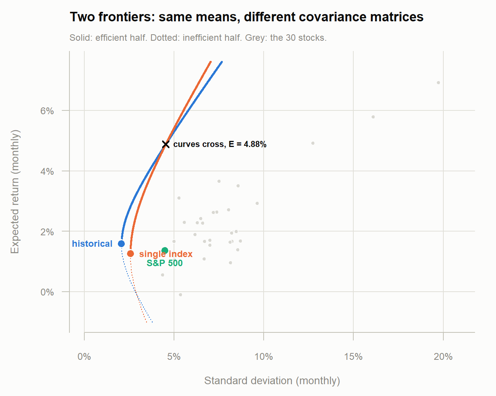
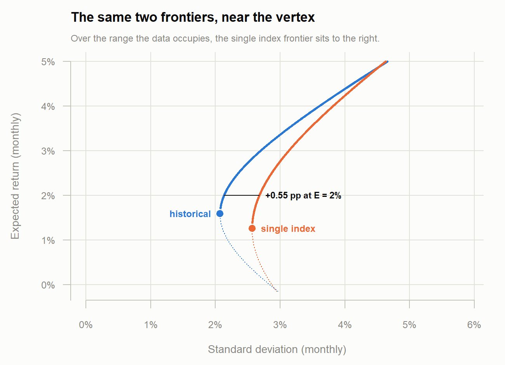

```{r setup, include=FALSE}
knitr::opts_chunk$set(echo = FALSE, comment = "#>", warning = FALSE,
                      message = FALSE, fig.pos = "H", out.extra = "")

invisible(capture.output(source("single_index.R")))

pct <- function(x, d = 2) sprintf(paste0("%.", d, "f%%"), x * 100)
```

Assuming the single index model

$$R_i = \alpha_i + \beta_i R_m + \epsilon_i, \qquad
  \mathrm{cov}(\epsilon_i, R_m) = 0, \qquad
  \mathrm{cov}(\epsilon_i, \epsilon_j) = 0 \ \ (i \neq j)$$

over 01-Jan-2017 to 01-Jan-2022. This is the same window as Projects 1 and 2,
so the return series is the same `r nrow(ret)` months on the same 30 stocks,
with `^GSPC` as the index $R_m$. Part 3 has to be drawn on Project 2's axes, so
using anything else would make the two frontiers incomparable.

## 1. Estimating $\alpha_i$, $\beta_i$, $\sigma^2_{\epsilon_i}$

Each stock's return is regressed on the index by ordinary least squares.
$\sigma^2_{\epsilon_i}$ is the residual variance, $\text{RSS}/(T-2)$ with
$T = `r nrow(ret)`$.

```{r simtable}
knitr::kable(
  data.frame(Stock = rownames(sim_tbl),
             `alpha (%)` = round(sim_tbl$alpha * 100, 4),
             beta        = round(sim_tbl$beta, 4),
             `sigma^2_e` = round(sim_tbl$sigma2_e, 6),
             `R^2`       = round(sim_tbl$R2, 4),
             check.names = FALSE, row.names = NULL),
  caption = "Single index model estimates, monthly, 30 stocks")
```

```{r simsummary}
cat(sprintf("market:  mean %.4f%%   sd %.4f%%\n", mean(Rm) * 100, sd(Rm) * 100))
cat(sprintf("beta  :  %.3f to %.3f, mean %.3f\n", min(beta), max(beta), mean(beta)))
cat(sprintf("R^2   :  %.3f to %.3f, mean %.3f\n", min(r2), max(r2), mean(r2)))
```

**The single index model changes the covariance matrix only.** The mean vector
feeding the frontier is untouched, so any difference in part 3 comes from
$\Sigma$ alone.

## 2. The single index variance-covariance matrix

$$\sigma_{ij} = \beta_i\beta_j\sigma^2_m \quad (i \neq j),
  \qquad
  \sigma_{ii} = \beta_i^2\sigma^2_m + \sigma^2_{\epsilon_i}$$

so in matrix form $\Sigma_{SIM} = \sigma^2_m\,\beta\beta' +
\mathrm{diag}(\sigma^2_{\epsilon})$.

```{r simcov}
cat(sprintf("dimension               %d x %d, symmetric\n", nrow(S_sim), ncol(S_sim)))
cat(sprintf("smallest eigenvalue     %.3e  (positive definite)\n", min(ev_sim)))
cat(sprintf("condition number        %.1f   vs %.1f for the historical matrix\n",
            max(ev_sim) / min(ev_sim), max(ev_hist) / min(ev_hist)))
cat(sprintf("free parameters         %d    vs %d, from %d months of data\n",
            2 * N + 1, N * (N + 1) / 2, Tn))
```

```{r simcorner}
knitr::kable(signif(S_sim[1:6, 1:6], 3),
             caption = "Top-left corner of the single index matrix")
```

## 3. The frontier under both matrices

Repeating Project 2 part (e) — the hyperbola
$\sigma^2 = 1/C + (C/D)(E - A/C)^2$ — with $\Sigma_{SIM}$ in place of the
historical matrix, holding $\bar{R}$ fixed.

```{r abcd}
knitr::kable(data.frame(
  Matrix = c("Historical (Project 2)", "Single index"),
  A = round(c(f_hist$A, f_sim$A), 4),
  B = round(c(f_hist$B, f_sim$B), 5),
  C = round(c(f_hist$C, f_sim$C), 2),
  D = round(c(f_hist$D, f_sim$D), 2),
  `E min (%)`  = round(c(f_hist$Emin, f_sim$Emin) * 100, 3),
  `sd min (%)` = round(c(f_hist$sdmin, f_sim$sdmin) * 100, 3),
  check.names = FALSE, row.names = NULL))
```

```{r frontierfig, out.width="100%"}

```

```{r zoomfig, out.width="100%"}

```

## Appendix: full code

```{r code, echo=TRUE, eval=FALSE, code=readLines("single_index.R")}
```
