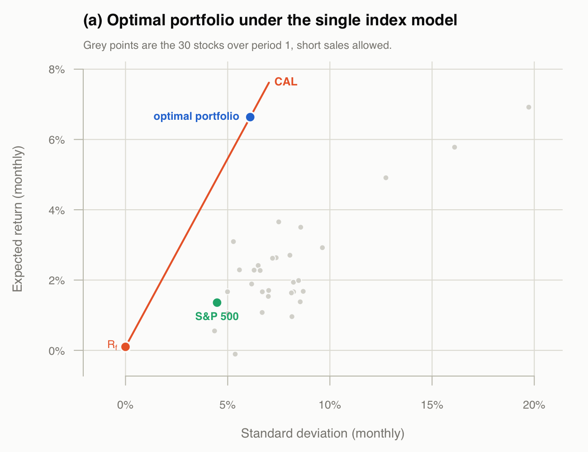
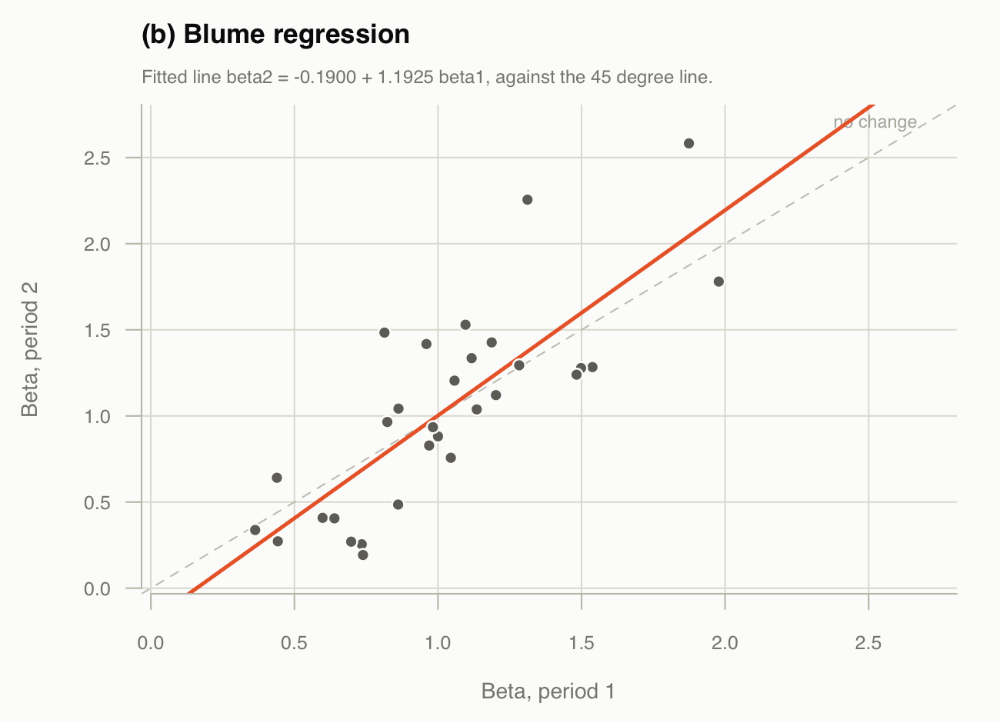
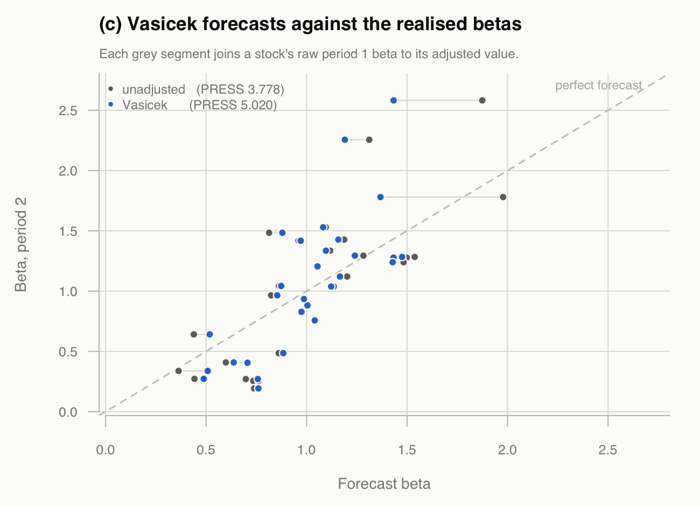

```{r setup, include=FALSE}
knitr::opts_chunk$set(echo = FALSE, comment = "#>", warning = FALSE,
                      message = FALSE, fig.pos = "H", out.extra = "")

invisible(capture.output(source("beta_adjust.R")))

pct <- function(x, d = 2) sprintf(paste0("%.", d, "f%%"), x * 100)
```

Assuming the single index model

$$R_i = \alpha_i + \beta_i R_m + \epsilon_i, \qquad
  \mathrm{cov}(\epsilon_i, R_m) = 0, \qquad
  \mathrm{cov}(\epsilon_i, \epsilon_j) = 0 \ \ (i \neq j)$$

on the same 30 stocks with `^GSPC` as $R_m$. Two periods are needed here:

```{r periods}
cat(sprintf("period 1  01-Jan-2017 to 01-Jan-2022   %d returns\n", p1$Tn))
cat(sprintf("period 2  01-Jan-2022 to 31-Jul-2026   %d returns\n", p2$Tn))
```

Period 1 is the training file, so the estimates there are Project 4's.

## (a)

The model gives $\Sigma$ from the betas and residual variances alone,

$$\sigma_{ij} = \beta_i\beta_j\sigma^2_m \ \ (i \neq j), \qquad
  \sigma_{ii} = \beta_i^2\sigma^2_m + \sigma^2_{\epsilon_i}$$

and with short sales allowed the optimum is

$$\mathbf{Z} = \Sigma^{-1}(\bar{R} - R_f\mathbf{1}), \qquad
  x_i = \frac{z_i}{\sum_j z_j}$$

```{r posbeta}
cat(sprintf("stocks with positive beta: %d of %d\n", sum(pos), length(pos)))
cat(sprintf("beta range %.3f (%s) to %.3f (%s)\n",
            min(p1$beta), stk[which.min(p1$beta)],
            max(p1$beta), stk[which.max(p1$beta)]))
cat(sprintf("Rf = %.4f per month\n", Rf))
```

Every beta is positive, so the filter removes nothing.

```{r weights}
knitr::kable(data.frame(
  Stock  = sel,
  Weight = round(unname(x), 4),
  Beta   = round(unname(beta), 4),
  row.names = NULL),
  caption = "Composition of the optimal portfolio")
```

```{r gstats}
cat(sprintf("C*             = %.6f\n", C_star))
cat(sprintf("E              = %.6f  (%s per month)\n", E_G, pct(E_G, 3)))
cat(sprintf("sd             = %.6f  (%s per month)\n", sd_G, pct(sd_G, 3)))
cat(sprintf("Sharpe         = %.4f\n", sharpe_G))
cat(sprintf("portfolio beta = %.4f\n", beta_G))
cat(sprintf("short positions = %d of %d, sum|x| = %.2f\n",
            sum(x < 0), length(x), sum(abs(x))))
```

```{r tangencyfig, out.width="100%"}

```

The same vector two other ways, as checks:

```{r achecks}
cat(sprintf("max |Sherman-Morrison - solve()|  %.2e\n", max(abs(sm %*% Rex - Z))))
cat(sprintf("max |cut-off form - Z|            %.2e\n", max(abs(z_egp - Z))))
```

$\Sigma$ is diagonal plus rank one, so Sherman–Morrison inverts it in closed
form. Expanding that inverse gives the cut-off form of handout #13,

$$z_i = \frac{\beta_i}{\sigma^2_{\epsilon_i}}
        \left(\frac{\bar{R}_i - R_f}{\beta_i} - C^*\right), \qquad
  C^* = \frac{\sigma^2_m\sum_j \frac{(\bar{R}_j - R_f)\beta_j}{\sigma^2_{\epsilon_j}}}
             {1 + \sigma^2_m\sum_j \frac{\beta^2_j}{\sigma^2_{\epsilon_j}}}$$

With short sales allowed there is no cut-off to apply: every stock enters, long
if $(\bar{R}_i - R_f)/\beta_i$ exceeds $C^*$ and short if not.

## (b) Blume

$$\beta_{i,2} = a + b\,\beta_{i,1} \quad\longrightarrow\quad
  \hat{\beta}_{i,3} = a + b\,\beta_{i,2}$$

```{r blumefit}
cat(sprintf("beta2 = %.4f + %.4f beta1   (R^2 = %.3f)\n", b_int, b_slope, b_r2))
cat(sprintf("\n            mean      sd\n"))
cat(sprintf("period 1  %.4f  %.4f\n", mean(p1$beta), sd(p1$beta)))
cat(sprintf("period 2  %.4f  %.4f\n", mean(p2$beta), sd(p2$beta)))
cat(sprintf("forecast  %.4f  %.4f\n", mean(beta_next), sd(beta_next)))
```

```{r blumefig, out.width="100%"}

```

## (b) Vasicek

$$\beta_{i}^{adj} =
  \frac{\sigma^2_{\beta_i}}{\sigma^2_{\beta_i} + \sigma^2_{\beta_1}}\,\bar{\beta}_1
  \;+\;
  \frac{\sigma^2_{\beta_1}}{\sigma^2_{\beta_i} + \sigma^2_{\beta_1}}\,\beta_{i,1}$$

where $\sigma^2_{\beta_i}$ is the squared standard error of stock $i$'s beta in
period 1 and $\sigma^2_{\beta_1}$ the variance of the betas across stocks.

```{r vasstats}
cat(sprintf("beta_bar                 = %.4f\n", beta_bar))
cat(sprintf("cross-sectional variance = %.5f\n", var_b1))
cat(sprintf("weight on the mean: %.3f to %.3f (median %.3f)\n",
            min(w_prior), max(w_prior), median(w_prior)))
cat(sprintf("beta sd: raw %.4f -> adjusted %.4f\n", sd(p1$beta), sd(beta_vas)))
```

```{r betatable}
knitr::kable(data.frame(
  Stock            = betas$stock,
  `Beta p1`        = round(betas$beta1, 4),
  `Beta p2`        = round(betas$beta2, 4),
  Vasicek          = round(betas$vasicek, 4),
  `Blume forecast` = round(betas$blume_next, 4),
  check.names = FALSE, row.names = NULL),
  caption = "Raw betas by period, the Vasicek adjustment of period 1, and the Blume forecast")
```

## (c)

$$\mathrm{PRESS} = \sum_{i=1}^{n}\left(\beta_i^{adj} - \beta_{i,2}\right)^2$$

taking the sum of squared forecast errors, as in Homework 4 exercise 1.

```{r press}
cat(sprintf("Vasicek     %.4f   (mean square %.6f)\n", press_vas, press_vas / length(stk)))
cat(sprintf("unadjusted  %.4f   (mean square %.6f)\n", press_raw, press_raw / length(stk)))
```

```{r vasicekfig, out.width="100%"}

```

The unadjusted period 1 betas are shown alongside as a reference point; their
PRESS of `r sprintf("%.4f", press_raw)` is the one decomposed in Homework 4
exercise 1. The betas in this sample dispersed rather than reverting — their
cross-sectional standard deviation rose from
`r sprintf("%.3f", sd(p1$beta))` to `r sprintf("%.3f", sd(p2$beta))` — which is
also why the Blume slope came out above one.

## Appendix: full code

```{r code, echo=TRUE, eval=FALSE, code=readLines("beta_adjust.R")}
```
