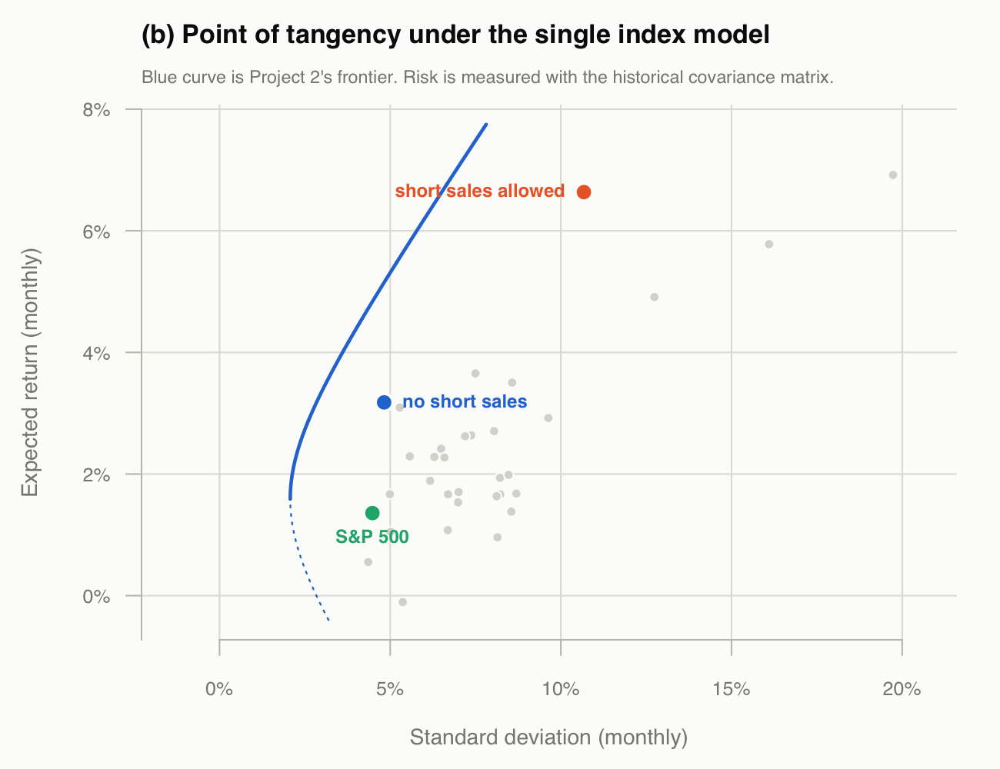
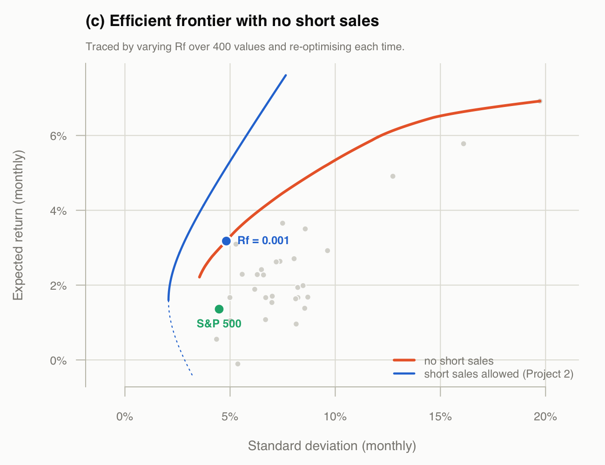
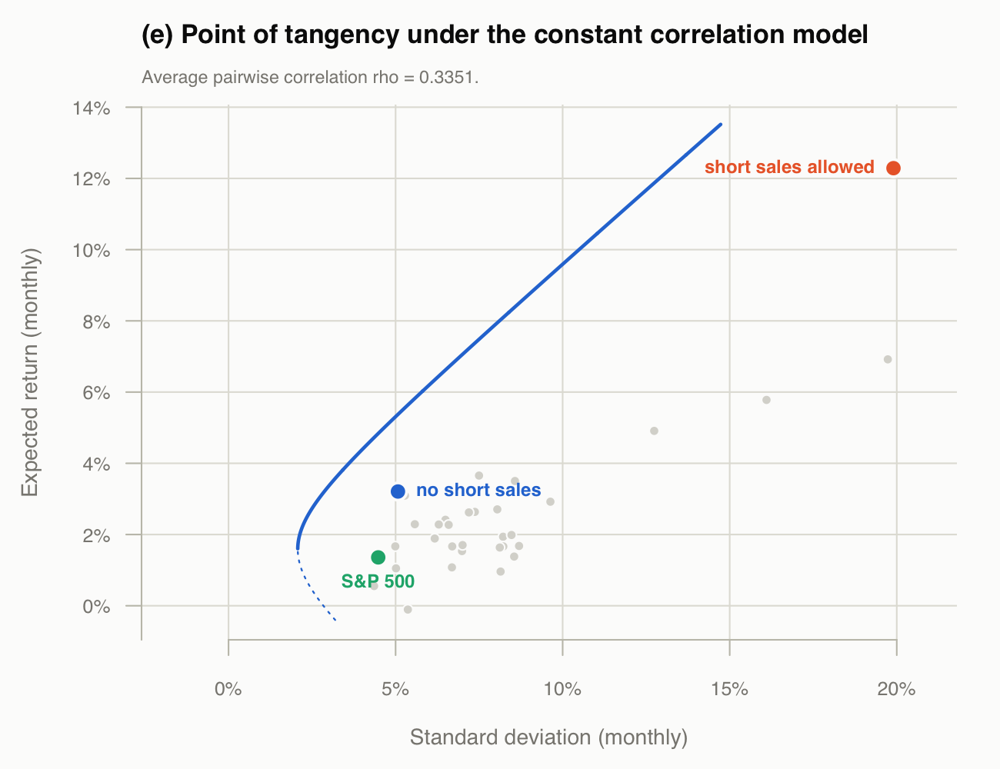

```{r setup, include=FALSE}
knitr::opts_chunk$set(echo = FALSE, comment = "#>", warning = FALSE,
                      message = FALSE, fig.pos = "H", out.extra = "")

invisible(capture.output(source("optimization.R")))

pct <- function(x, d = 2) sprintf(paste0("%.", d, "f%%"), x * 100)
```

The training file again, the same `r nrow(ret)` returns on 30 stocks used in
Projects 1, 2, 4 and 5, with $R_f = `r Rf`$ carried over from Project 5. All 30
betas are positive, so the filter in (a) removes nothing.

## (a)

Stocks ranked by the excess return to beta ratio, with the cut-off values of
handout #28:

$$C_i = \frac{\sigma^2_m \sum_{j=1}^{i}
              \frac{(\bar{R}_j - R_f)\beta_j}{\sigma^2_{\epsilon_j}}}
             {1 + \sigma^2_m \sum_{j=1}^{i}
              \frac{\beta^2_j}{\sigma^2_{\epsilon_j}}}$$

```{r tablea}
knitr::kable(data.frame(
  Stock  = tblA$stock,
  `R-Rf` = round(tblA$Rbar_Rf, 5),
  beta   = round(tblA$beta, 4),
  `ratio` = round(tblA$ratio, 5),
  `s2e`  = round(tblA$sig2e, 5),
  `Ai`   = round(tblA$num, 4),
  `sum Ai` = round(tblA$cum_num, 4),
  `Bi`   = round(tblA$den, 2),
  `sum Bi` = round(tblA$cum_den, 2),
  `Ci`   = round(tblA$Ci, 5),
  check.names = FALSE, row.names = NULL),
  caption = "Ranking by excess return to beta. ratio = (R-Rf)/beta, Ai = (R-Rf)beta/s2e, Bi = beta^2/s2e")
```

## (b)

With short sales allowed every stock is held and the cut-off is $C^* = C_{30}$.
Without short sales, $C^*$ is the last $C_i$ for which the ratio still exceeds
it, and only the stocks above that point are held. In both cases

$$z_i = \frac{\beta_i}{\sigma^2_{\epsilon_i}}
        \left(\frac{\bar{R}_i - R_f}{\beta_i} - C^*\right), \qquad
  x_i = \frac{z_i}{\sum_j z_j}$$

```{r bcut}
cat(sprintf("short sales allowed : C* = C_30 = %.6f, 30 stocks, %d short\n",
            ss$Cstar, sum(ss$x < 0)))
cat(sprintf("no short sales      : C* = C_%d  = %.6f, %d stocks held\n",
            noss$cutoff, noss$Cstar, noss$cutoff))
```

```{r bweights}
w_ss <- ss$x[tblA$stock]
knitr::kable(data.frame(
  Stock              = tblA$stock,
  `Short sales`      = round(unname(w_ss), 4),
  `No short sales`   = round(unname(ifelse(tblA$stock %in% names(noss$x),
                                           noss$x[tblA$stock], 0)), 4),
  check.names = FALSE, row.names = NULL),
  caption = "Composition of the point of tangency, in ranked order")
```

```{r bstats}
cat(sprintf("%-18s %9s %11s %11s\n", "", "E", "sd (hist)", "sd (SIM)"))
cat(sprintf("%-18s %8.4f%% %10.4f%% %10.4f%%\n", "short sales",
            st_ss["E"]*100, st_ss["sd"]*100, st_ss_sim["sd"]*100))
cat(sprintf("%-18s %8.4f%% %10.4f%% %10.4f%%\n", "no short sales",
            st_noss["E"]*100, st_noss["sd"]*100, st_noss_sim["sd"]*100))
```

Risk is reported under both matrices: the portfolios are optimised with the
single index matrix, but the plots put them alongside the 30 stocks and Project
2's frontier, which are historical.

```{r bcheck}
cat(sprintf("max |short sales weights - Project 5 part (a)| = %.2e\n",
            max(abs(ss$x[stk] - x5[stk]))))
```

```{r bfig, out.width="100%"}

```

## (c)

Varying $R_f$ and re-running the no short sales procedure at each value gives a
different tangency portfolio each time; the locus of those points is the
efficient frontier under the constraint.

```{r cstats}
cat(sprintf("Rf from %.4f to %.4f, %d portfolios\n",
            min(noss_fr$Rf), max(noss_fr$Rf), nrow(noss_fr)))
cat(sprintf("E  from %s to %s\n", pct(min(noss_fr$E), 3), pct(max(noss_fr$E), 3)))
cat(sprintf("sd from %s to %s\n", pct(min(noss_fr$sd), 3), pct(max(noss_fr$sd), 3)))
cat(sprintf("stocks held: %d at the lowest Rf, down to %d at the highest\n",
            max(noss_fr$k), min(noss_fr$k)))
```

```{r cfig, out.width="100%"}

```

## (d)

Under the constant correlation model every pair of stocks shares the same
correlation $\rho$, estimated as the average of the
`r sprintf("%d", 30*29/2)` pairwise correlations. Stocks are ranked by the
excess return to standard deviation ratio, and

$$C_i = \frac{\rho}{1 - \rho + i\rho}\sum_{j=1}^{i}
        \frac{\bar{R}_j - R_f}{\sigma_j}$$

```{r rho}
cat(sprintf("rho = %.6f   (pairwise correlations range %.3f to %.3f)\n",
            rho, min(CC[upper.tri(CC)]), max(CC[upper.tri(CC)])))
```

```{r tabled}
knitr::kable(data.frame(
  Stock       = tblD$stock,
  `R-Rf`      = round(tblD$Rbar_Rf, 5),
  sd          = round(tblD$sd, 4),
  ratio       = round(tblD$ratio, 5),
  `sum ratio` = round(tblD$cum_ratio, 4),
  multiplier  = round(tblD$mult, 5),
  Ci          = round(tblD$Ci, 5),
  check.names = FALSE, row.names = NULL),
  caption = "Ranking by excess return to standard deviation. ratio = (R-Rf)/sd, multiplier = rho/(1-rho+i*rho)")
```

## (e)

Same cut-off rule, with the constant correlation weights

$$z_i = \frac{1}{(1-\rho)\sigma_i}
        \left(\frac{\bar{R}_i - R_f}{\sigma_i} - C^*\right)$$

```{r ecut}
cat(sprintf("short sales allowed : C* = C_30 = %.6f, 30 stocks, %d short\n",
            cc_ss$Cstar, sum(cc_ss$x < 0)))
cat(sprintf("no short sales      : C* = C_%d  = %.6f, %d stocks held\n",
            cc_noss$cutoff, cc_noss$Cstar, cc_noss$cutoff))
```

```{r eweights}
knitr::kable(data.frame(
  Stock            = tblD$stock,
  `Short sales`    = round(unname(cc_ss$x[tblD$stock]), 4),
  `No short sales` = round(unname(ifelse(tblD$stock %in% names(cc_noss$x),
                                         cc_noss$x[tblD$stock], 0)), 4),
  check.names = FALSE, row.names = NULL),
  caption = "Composition of the point of tangency under constant correlation, in ranked order")
```

```{r estats}
cat(sprintf("%-18s %9s %11s\n", "", "E", "sd (hist)"))
cat(sprintf("%-18s %8.4f%% %10.4f%%\n", "short sales",
            st_cc_ss["E"]*100, st_cc_ss["sd"]*100))
cat(sprintf("%-18s %8.4f%% %10.4f%%\n", "no short sales",
            st_cc_noss["E"]*100, st_cc_noss["sd"]*100))
```

```{r efig, out.width="100%"}

```

## Appendix: full code

```{r code, echo=TRUE, eval=FALSE, code=readLines("optimization.R")}
```
