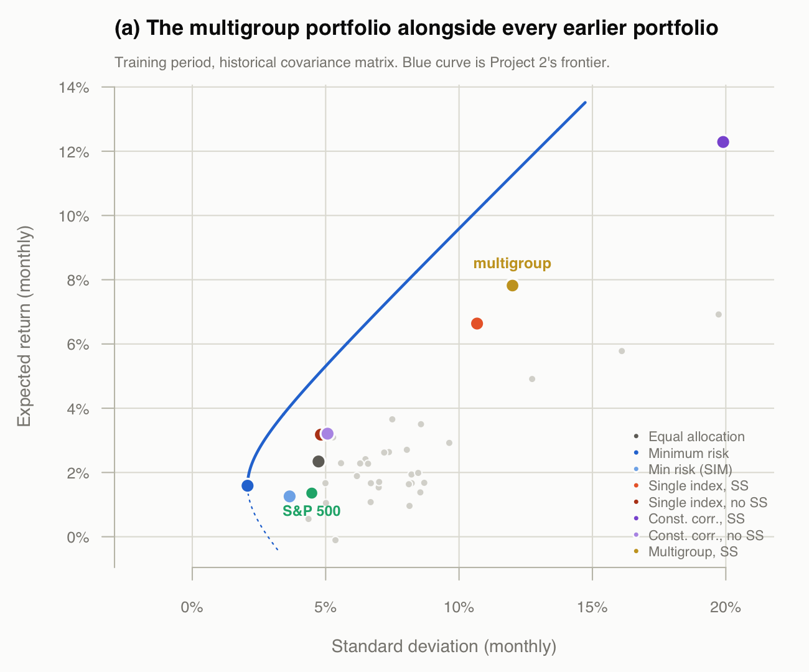
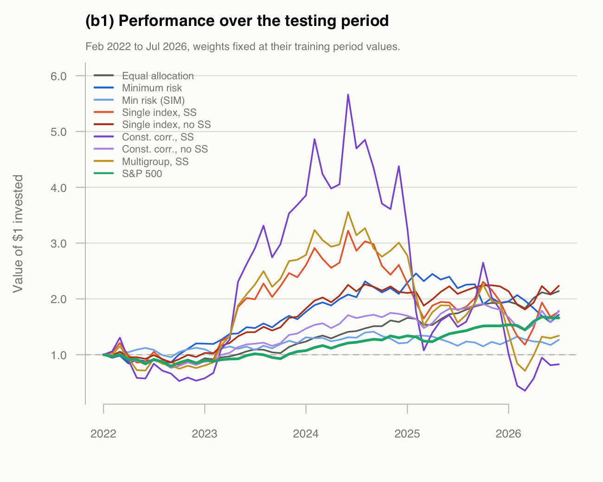
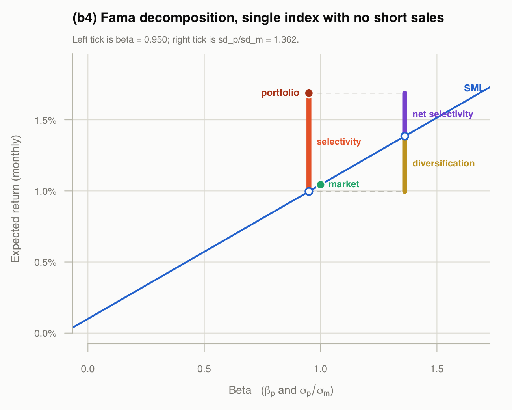

```{r setup, include=FALSE}
knitr::opts_chunk$set(echo = FALSE, comment = "#>", warning = FALSE,
                      message = FALSE, fig.pos = "H", out.extra = "")

invisible(capture.output(source("performance.R")))

pct <- function(x, d = 2) sprintf(paste0("%.", d, "f%%"), x * 100)
```

Portfolios are built on the training period, the same `r nrow(r1)` returns used
in Projects 1, 2, 4, 5 and 6, with $R_f = `r Rf`$. Part (b) then evaluates them
on the `r nrow(r2)` months of the testing period, with the weights held fixed at
their training period values.

## (a)

The multigroup model assumes correlation is constant within each group and
constant between any two groups, so the $30\times30$ correlation matrix
collapses to the $5\times5$ matrix of the five sectors:

```{r rhomat}
knitr::kable(round(rho, 4), caption = "Within and between group correlations")
```

For stock $i$ in group $k$,

$$z_i = \frac{1}{(1-\rho_{kk})\sigma_i}
        \left(\frac{\bar{R}_i - R_f}{\sigma_i} - C_k\right)$$

where the group cut-offs solve the $K \times K$ system of handout #37,

$$C_k + \sum_{l=1}^{K}\frac{\rho_{kl}N_l}{1-\rho_{ll}}\,C_l
  = \sum_{l=1}^{K}\frac{\rho_{kl}A_l}{1-\rho_{ll}}, \qquad
  A_l = \sum_{i \in l}\frac{\bar{R}_i - R_f}{\sigma_i}$$

```{r ck}
knitr::kable(data.frame(Group = names(Ck), `A_k` = round(Ak, 4),
                        `C_k` = round(unname(Ck), 6),
                        check.names = FALSE, row.names = NULL),
             caption = "Group sums and cut-offs")
```

```{r mgcheck}
cat(sprintf("max |handout 37 route - Sigma^-1 (Rbar - Rf 1)| = %.2e\n",
            max(abs(z_h37 - Z_mg))))
```

```{r mgweights}
knitr::kable(data.frame(
  Stock  = stk,
  Group  = gnames[grp],
  Weight = round(unname(x_mg), 4),
  row.names = NULL),
  caption = "Composition of the multigroup optimal portfolio, short sales allowed")
```

```{r mgstats}
cat(sprintf("E  = %s per month\n", pct(tr_E["Multigroup, SS"], 4)))
cat(sprintf("sd = %s per month\n", pct(tr_sd["Multigroup, SS"], 4)))
cat(sprintf("%d short positions, sum|x| = %.2f\n", sum(x_mg < 0), sum(abs(x_mg))))
```

```{r mgfig, out.width="100%"}

```

## (b) 1

Growth of one dollar over the testing period, weights fixed:

```{r growthfig, out.width="100%"}

```

```{r finalval}
knitr::kable(data.frame(
  Portfolio = labels,
  `Final value of $1` = round(growth[nrow(growth), ], 4),
  check.names = FALSE, row.names = NULL),
  caption = "Value at 31-Jul-2026 of one dollar invested at the start")
```

## (b) 2

Average growth as the geometric mean, $\left(\prod_t (1+R_t)\right)^{1/T} - 1$:

```{r geotab}
knitr::kable(data.frame(
  Portfolio         = labels,
  `Geometric (%)`   = round(geo * 100, 4),
  `Arithmetic (%)`  = round(mu * 100, 4),
  `Std. dev. (%)`   = round(sdp * 100, 4),
  check.names = FALSE, row.names = NULL),
  caption = "Monthly average growth over the testing period")
```

## (b) 3

$$S_p = \frac{\bar{R}_p - R_f}{\sigma_p}, \qquad
  T_p = \frac{\bar{R}_p - R_f}{\beta_p}, \qquad
  \alpha_p = \bar{R}_p - \left[R_f + \beta_p(\bar{R}_m - R_f)\right]$$

and the differential excess return, the gap to the point on the capital market
line carrying the same total risk,

$$\bar{R}_p - \left[R_f + \frac{\sigma_p}{\sigma_m}(\bar{R}_m - R_f)\right]$$

```{r perftab}
knitr::kable(data.frame(
  Portfolio            = labels,
  beta                 = round(bet, 4),
  Sharpe               = round(sharpe, 4),
  `Diff. excess (%)`   = round(diffex * 100, 4),
  Treynor              = round(treynor, 4),
  `Jensen (%)`         = round(jensen * 100, 4),
  check.names = FALSE, row.names = NULL),
  caption = "Performance measures, testing period. Betas estimated on the testing period.")
```

## (b) 4

Fama's decomposition of `r fp`, splitting the overall gain over $R_f$ into the
part earned by taking systematic risk and the part earned by selection, then
splitting selection again by charging the portfolio for the diversification it
gave up:

$$\underbrace{\bar{R}_p - R_f}_{\text{overall}}
  = \underbrace{\beta_p(\bar{R}_m - R_f)}_{\text{risk}}
  + \underbrace{\left[\frac{\sigma_p}{\sigma_m} - \beta_p\right](\bar{R}_m - R_f)}_{\text{diversification}}
  + \underbrace{\bar{R}_p - R_f - \frac{\sigma_p}{\sigma_m}(\bar{R}_m - R_f)}_{\text{net selectivity}}$$

```{r famatab}
knitr::kable(data.frame(
  Component = c("Overall performance", "  from systematic risk",
                "  from selectivity", "    diversification",
                "    net selectivity"),
  `Percent per month` = round(c(fama["overall"], fama["risk"],
                                fama["selectivity"], fama["diversif"],
                                fama["net_select"]) * 100, 4),
  check.names = FALSE, row.names = NULL))
```

```{r famacheck}
cat(sprintf("beta               = %.4f\n", f_beta))
cat(sprintf("sd_p / sd_m        = %.4f\n", beta_eq))
cat(sprintf("risk + selectivity - overall            = %.2e\n",
            fama["risk"] + fama["selectivity"] - fama["overall"]))
cat(sprintf("diversification + net selectivity - sel = %.2e\n",
            fama["diversif"] + fama["net_select"] - fama["selectivity"]))
```

```{r famafig, out.width="100%"}

```

The portfolio sits at $\beta_p = `r sprintf("%.3f", f_beta)`$, and its total
risk corresponds to a beta of $\sigma_p/\sigma_m =
`r sprintf("%.3f", beta_eq)`$ had it been fully diversified. Diversification is
the SML distance between those two betas; net selectivity is what is left over
the SML at the higher one.

## Appendix: full code

```{r code, echo=TRUE, eval=FALSE, code=readLines("performance.R")}
```
