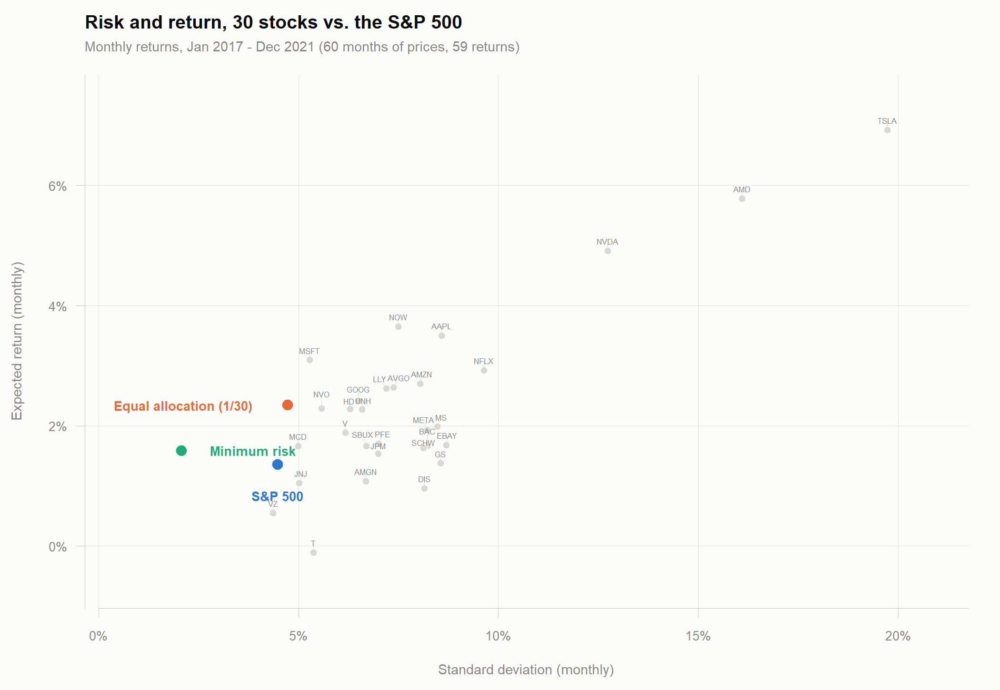

# Portfolio Management Project

Portfolio construction and evaluation on 30 stocks plus the S&P 500, using
monthly adjusted close prices from Yahoo Finance.

## Course roadmap

This repository covers the portfolio-management half of the course. The full
sequence of topics:

1. Combining individual stocks into portfolios (risk and expected return of a portfolio)
2. Maximizing return given risk, or minimizing risk given return
3. Properties of the minimum variance set (efficient frontier)
4. The single index model (with and without short sales allowed)
5. Constant correlation model (with and without short sales allowed)
6. Multigroup and multi-index models (short sales allowed)
7. Portfolio performance

Work so far covers topic 1 and the entry point to topic 2.

## Stock selection

Five sectors, six stocks each, giving 30 stocks. Sector labels follow Yahoo
Finance's taxonomy. The columns in the data files appear in this order, so each
sector is a contiguous block of six — convenient for the multigroup models in
topic 6.

| Sector | Tickers |
|---|---|
| Technology | NVDA, AAPL, MSFT, AVGO, AMD, NOW |
| Communication Services | GOOG, META, NFLX, VZ, DIS, T |
| Financial Services | V, JPM, MS, GS, BAC, SCHW |
| Consumer Cyclical | AMZN, TSLA, MCD, SBUX, HD, EBAY |
| Healthcare | LLY, NVO, UNH, JNJ, AMGN, PFE |

`^GSPC` (the S&P 500) is carried alongside as the market index, for a total of
31 assets.

## Data

Monthly adjusted close prices downloaded through the Shiny app in `app.R`.

| File | Period | Rows |
|---|---|---|
| `stockData_train.csv` | 2017-01 – 2021-12 | 60 months |
| `stockData_test.csv` | 2022-01 – 2026-07 | 55 months |

All analysis below uses the training file only — the first five years, as the
assignment requires. The test period is held back for out-of-sample evaluation
in topic 7.

Each file is laid out as a row index, a `Date` column, then the 31 assets, so
the assignment's starter snippet indexes correctly:

```r
a <- read.csv("stockData_train.csv", sep=",", header=TRUE)
r <- (a[-1,3:ncol(a)]-a[-nrow(a),3:ncol(a)])/a[-nrow(a),3:ncol(a)]
```

## Progress

Everything below is produced by `portfolio.R`.

**(b) Prices to returns.** Simple (arithmetic) returns,
`R_t = P_t / P_{t-1} - 1`. Simple rather than log returns because portfolio
return is a linear combination of asset returns only under this definition.
60 monthly prices yield 59 monthly returns across 31 assets.

**(c) Means, standard deviations, covariance matrix.** Per-asset statistics for
all 31 assets in `asset_stats.csv`; the 31×31 variance-covariance matrix in
`covmat.csv`. Portfolio construction below uses the 30×30 submatrix that
excludes `^GSPC`.

**(d) Risk–return plot.** All 31 assets in mean/standard-deviation space, with
the two portfolios overlaid — `risk_return.png`.

**(e) Equal allocation portfolio.** Equal weights across the 30 stocks
(w = 1/30 each).

**(f) Minimum risk portfolio.** Weights from the closed form

```
x = (Σ⁻¹ 1) / (1' Σ⁻¹ 1)
```

where Σ is the 30×30 covariance matrix of stock returns and 1 is a 30×1 vector
of ones.

### Results (monthly, 2017-02 – 2021-12)

| | Mean | Std. dev. |
|---|---|---|
| S&P 500 | 1.36% | 4.48% |
| Equal allocation (1/30) | 2.34% | 4.73% |
| Minimum risk | 1.59% | 2.07% |



Two observations worth carrying forward:

- **Diversification is visible in the numbers.** The average individual stock
  has a standard deviation near 8%, but equally weighting those same 30 stocks
  gives 4.73%. The minimum-risk portfolio reaches 2.07% — below every single
  asset in the set (the lowest individual is VZ at 4.36%).
- **The minimum-risk weights are unstable.** The solution places 0.84 on JPM
  and takes 14 short positions. This is expected behaviour for unconstrained
  minimum-variance optimization, amplified here because 59 observations are
  estimating a 30-asset covariance matrix — a T/N ratio of 1.97, where you want
  T ≫ N. The matrix does invert (condition number 831), so the math is sound,
  but the weights are partly fit to estimation noise and should not be expected
  to hold out of sample. Topics 4–6 introduce the structured covariance models
  (single index, constant correlation, multigroup) that address exactly this.

## Files

| File | Contents |
|---|---|
| `portfolio.R` | Analysis for parts (b)–(f) |
| `app.R` | Shiny app used to download prices from Yahoo Finance |
| `stockData_train.csv` / `stockData_test.csv` | Adjusted close prices |
| `returns_train.csv` | 59 × 31 monthly returns |
| `asset_stats.csv` | Per-asset mean and standard deviation |
| `covmat.csv` | 31 × 31 variance-covariance matrix |
| `risk_return.png` | Risk–return plot |

## Reproducing

Dependencies are pinned with [renv](https://rstudio.github.io/renv/), so
packages install into a project-local library rather than the global one.

```r
renv::restore()     # installs the exact versions in renv.lock
```

Then, from the project directory:

```
Rscript portfolio.R
```

Starting R in this directory activates the project library automatically via
`.Rprofile` — there is no environment to activate by hand.
